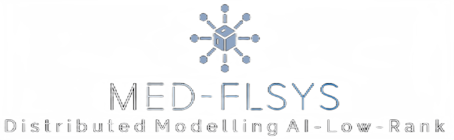

# Med-FLSys - Open Source Federated Learning Framewwork 
Open source Federated Learning Framework Distributed Modelling AI Low-Rank 

 
 
 

## Overview

Med-FLSys is an open-source Federated Learning (FL) framework designed for distributed modeling in AI, catering to multi-organization healthcare scenarios. It ensures a secure AI system with low-rank latency inference runtime models on services within high-performance API gateways like gRPC, emphasizing a **Data-Privacy-Driven-Policy**. This project aims to facilitate collaborative Federated Learning workloads for non-organizational AI infrastructures while prioritizing privacy and security in medical applications.

## Table of Contents

1. [Introduction](#introduction)
2. [Technologies](#technologies)
3. [Coming Features](#coming-features)
4. [Installation](#installation)
5. [Contributing](#contributing)
6. [License](#license)

## Introduction

Federated Learning is a paradigm that allows multiple parties to collaboratively build a shared AI model without exchanging medical data. Med-FLSys provides enhanced security and performance, built within Rust and JAX in the backend, specifically tailored for applications in the medical domain. It addresses the challenges of distributed modeling while ensuring the confidentiality of sensitive information.

## Technologies

This project utilizes the following technologies:

- [Rust](https://www.rust-lang.org/): A systems programming language known for its performance, reliability, and memory safety.
- [CUDA Programming](https://developer.nvidia.com/cuda-zone): Utilized for parallel computing on NVIDIA GPUs, enhancing the computational capabilities of the system.
- [JAX / XAL](https://jax.readthedocs.io/en/latest/): A high-performance numerical computing library for machine learning research.
- [PyTorch](https://pytorch.org/): An open-source machine learning framework that facilitates dynamic computational graphs.

## Coming Features

- **General High-Level Framework Structure**: [Brief description of planned framework enhancements.]
  
- **Building the WebSocket-based Class**: [Outline of the upcoming WebSocket-based class and its significance.]

##### Contributing

We welcome contributions from the community. Please follow the guidelines in the Contributing section to report issues or submit pull requests.here the Guidelines [section](Contribution.md)

#### License

Med-FLSys is released under the [Apache license] license. See the License section for details.
